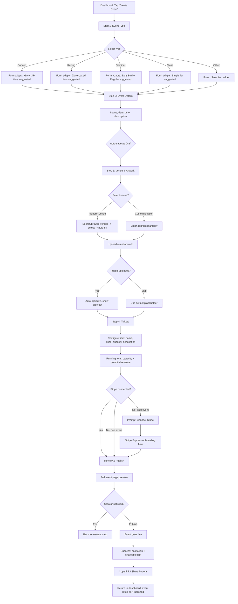
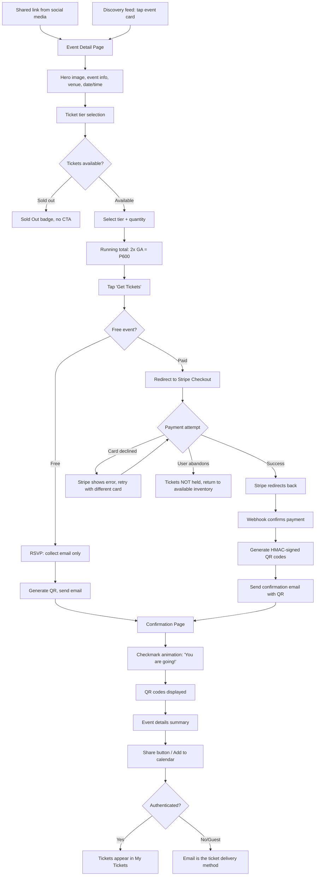
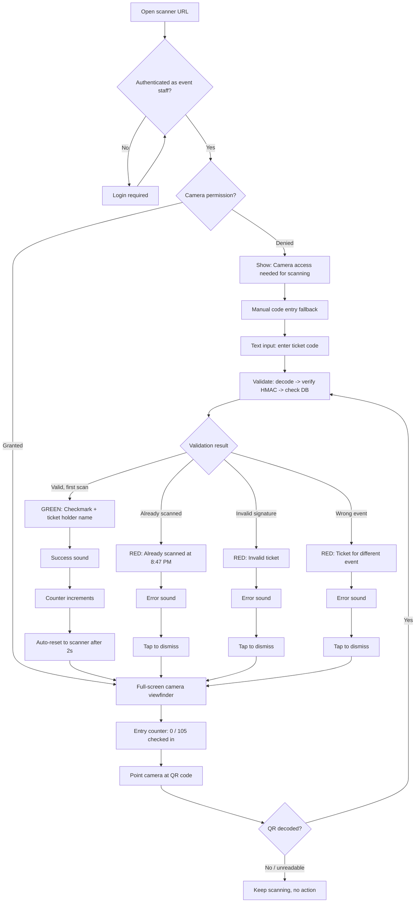
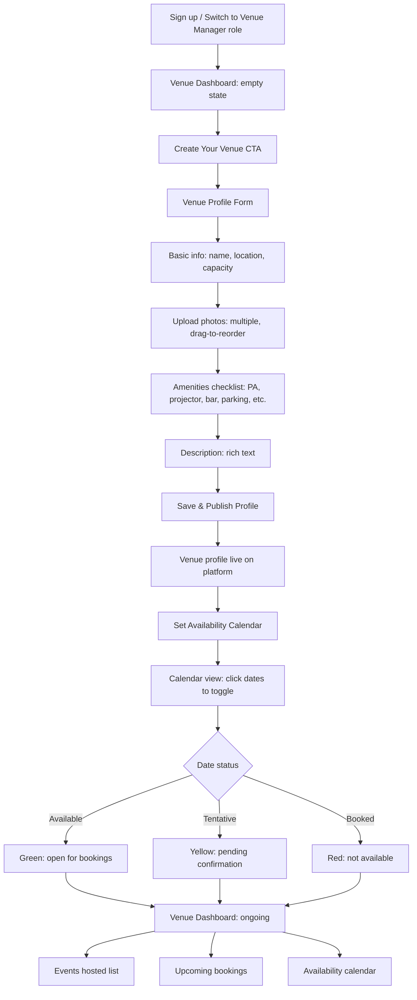
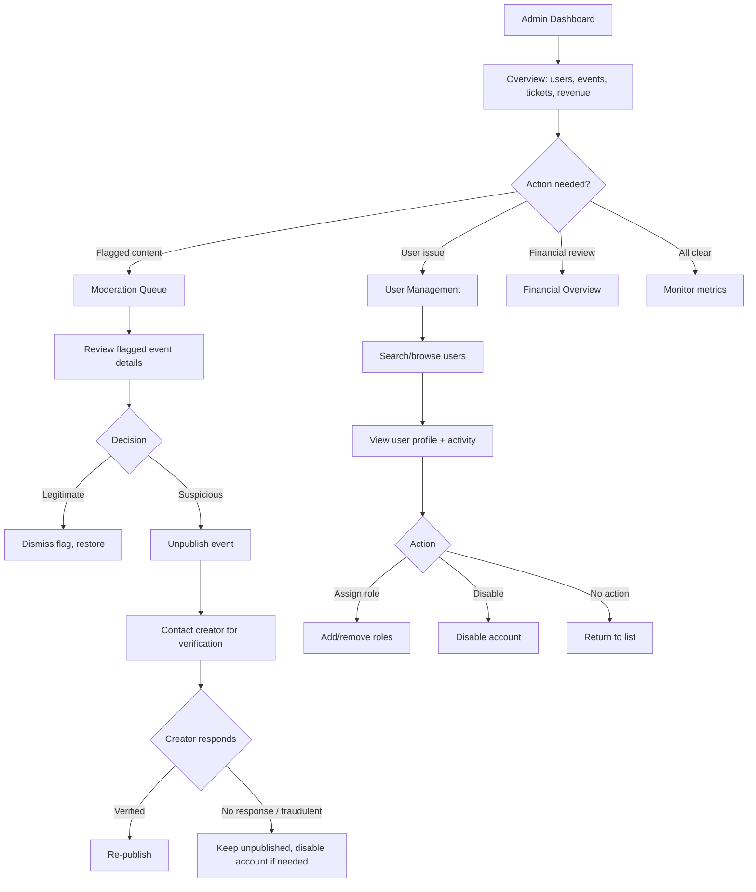

# UX Design Specification: Universal Ticketing System

**Author:** ringmaster
**Date:** 2026-03-06

---

<!-- UX design content will be appended sequentially through collaborative workflow steps -->

## Executive Summary

### Project Vision

Universal Ticketing System is a multi-sided event marketplace serving the Philippine live events scene. It unifies event creation, ticketing, discovery, and venue management into one platform — replacing the fragmented landscape of GCash screenshots, Viber groups, Instagram DMs, and Google Sheets that creators and organizers currently rely on.

The platform connects four user types through an Event Ecosystem Flywheel: creators publish events, attendees discover and purchase tickets, venues provide spaces, and the cycle reinforces itself. The core UX promise is radical simplification — a creator publishes an event in under 15 minutes, an attendee goes from browse to confirmed ticket in under 2 minutes, and a QR scan validates entry in under 5 seconds.

### Target Users

| Persona | Profile | Primary Device | Tech Savviness | Core UX Need |
|---------|---------|---------------|----------------|--------------|
| **Marco** (Creator/Artist) | 28, independent musician, Cebu | Mobile-first, desktop for dashboard | Moderate — uses Instagram, GCash daily | Quick event setup, clear revenue tracking |
| **Dianne** (Organizer) | 35, racing league ops manager | Desktop for management, mobile on-site | High — manages complex logistics | Multi-event control, zone-based scanning |
| **Jai** (Attendee) | 24, young professional, Manila | Mobile-dominant | High — digital native | Fast discovery, frictionless checkout |
| **Carlos** (Venue Manager) | 42, venue owner, Makati | Desktop for management | Moderate | Venue visibility, booking pipeline |
| **Ringmaster** (Admin) | Platform operator | Desktop | High | Platform health, moderation tools |

**Key user context:** Filipino market. GCash and card payments. Philippine Peso (PHP). Social-media-driven discovery (Instagram stories, Facebook groups, Viber chats). Mobile-first attendee experience is critical — event links shared via social media are opened on phones.

### Key Design Challenges

1. **Multi-role identity in one account** — Users can be attendee, artist, organizer, venue manager simultaneously. Role switching must be intuitive and never confusing. The UI must adapt to the active role without overwhelming users with capabilities they don't need right now.

2. **Complex event creation made simple** — Event creation involves type selection, ticket tier configuration (up to 5+ tiers with varying prices/quantities), artwork upload, venue selection, and publishing. This multi-step flow must feel lightweight for Marco's simple concert while supporting Dianne's complex racing event with 5 ticket zones.

3. **Real-time trust at the door** — QR scanning is the highest-stakes UX moment. Door staff (often volunteers) need a scanner that works instantly, shows clear pass/fail states, and handles edge cases (duplicate scans, wrong zone) without confusion. Failure here undermines the entire platform promise.

4. **Four distinct dashboard experiences** — Creator, organizer, venue manager, and admin dashboards serve very different needs but must feel like the same product. Design system consistency is critical.

5. **Mobile-first for attendees, desktop-first for creators** — The same platform must deliver an excellent mobile discovery/purchase experience AND an efficient desktop management experience. These are fundamentally different interaction paradigms.

### Design Opportunities

1. **"11-minute event" onboarding** — If a creator can go from signup to published event in under 15 minutes (Marco's journey), that's a powerful differentiator. Smart defaults, event-type-aware templates, and progressive disclosure can make this feel magical.

2. **Social-native sharing** — Events are discovered via Instagram stories and Viber groups. Rich Open Graph previews, one-tap sharing, and beautiful event pages that feel share-worthy create organic distribution.

3. **Scanner page as trust builder** — A reliable, satisfying scan experience (clear green/red states, audible feedback, real-time counter) builds creator confidence in the platform faster than any feature list.

4. **Venue marketplace discovery** — Venue profiles with photos, amenities, and availability calendars create a marketplace experience that doesn't exist in the current Viber-based venue booking world.

## Core User Experience

### Defining Experience

The platform has two core loops that feed each other:

**Supply Loop (Creator):** Sign up -> Create event -> Sell tickets -> Validate at door -> See revenue -> Create next event

**Demand Loop (Attendee):** Discover event -> View details -> Buy ticket -> Show QR at door -> Attend

The single most critical interaction is the **ticket purchase flow** — it's the transaction that makes the flywheel turn. Every ticket sold validates a creator, funds the platform, and creates an attendee who may return. The second most critical is **QR validation at the door** — this is where the platform's promise is physically tested in front of real people.

If we nail these two, everything else follows.

### Platform Strategy

| Context | Platform | Interaction Mode | Priority |
|---------|----------|-----------------|----------|
| **Event discovery & purchase** | Mobile web (responsive) | Touch — thumb-driven, one-handed | Primary |
| **Event creation & dashboard** | Desktop web (responsive) | Mouse/keyboard — form-heavy, data-dense | Primary |
| **QR scanning at door** | Mobile/tablet web | Touch — camera-based, full-screen | Critical |
| **Venue management** | Desktop web | Mouse/keyboard — calendar, data entry | Secondary |
| **Admin panel** | Desktop web | Mouse/keyboard — tables, moderation | Secondary |

**Key platform decisions:**
- **Web-only** — no native app for MVP. Mobile web must feel app-like for attendees.
- **No offline requirement for MVP** — QR codes should display from cached/screenshot if network drops, but validation requires connectivity.
- **Camera API** — scanner page leverages device camera for QR scanning. Must request permission gracefully.
- **PWA potential** — service worker for offline ticket display deferred to Phase 2.

### Effortless Interactions

| Interaction | Current Pain | Our Target | How |
|------------|-------------|-----------|-----|
| **Event creation** | 3+ hours (GCash, Viber, spreadsheets) | <15 minutes end-to-end | Smart defaults, event-type templates, progressive disclosure |
| **Ticket purchase** | Screenshot GCash receipt, DM organizer | <2 minutes, zero messages sent | Stripe Checkout handles everything — one redirect, done |
| **Door entry** | "Check the list," arguments about payment | <5 seconds per scan | Full-screen scanner, instant green/red, audible feedback |
| **Revenue tracking** | Manual count of GCash screenshots | Zero effort — always accurate | Real-time dashboard, automatic Stripe reconciliation |
| **Event discovery** | Check 4 Instagram accounts + 3 Facebook pages | One page, filtered, searchable | Event feed with type/date/location filters |

**Zero-thought interactions (should happen automatically):**
- Ticket inventory updates when someone purchases (no manual count)
- QR code generation and delivery on purchase (no creator action)
- Sold-out status display when tickets exhausted (no manual toggle)
- Event lifecycle transitions (Published -> On Sale when first ticket sold)
- Image optimization on upload (no manual resizing)

### Critical Success Moments

| Moment | What Happens | Success Feels Like | Failure Feels Like |
|--------|-------------|-------------------|-------------------|
| **First event published** | Creator completes setup, hits publish | "That was way easier than I expected" | "This is more complicated than my current process" |
| **First ticket sold** | Creator sees sale appear on dashboard | "It's working! Real money, tracked automatically" | Sale doesn't appear, creator doubts the system |
| **QR scan at door** | Green checkmark, 2 seconds | "Smooth. Professional. No drama." | Slow, confusing, creates a line — embarrassing |
| **Duplicate scan caught** | Red alert with timestamp | "The system caught it — my tickets are secure" | Duplicate gets through — trust destroyed |
| **Checkout complete** | QR codes appear, email sent | "Done. I have my tickets." | Ambiguous state — did it work? |
| **Revenue payout** | Stripe deposits to creator's bank | "I got paid without chasing anyone" | Unclear when/how money arrives |

### Experience Principles

1. **Clarity over cleverness** — Every screen answers "what do I do here?" within 3 seconds. No ambiguous states. Green means yes, red means no. Numbers are exact, not estimated. Status is always visible.

2. **Creator confidence** — The platform must make creators feel in control and informed. Real-time sales data, clear revenue breakdowns, reliable door scanning. Creators stake their reputation on this tool — it must never let them down in front of their audience.

3. **Attendee momentum** — Never break the flow from "this looks interesting" to "I have my ticket." Minimize taps, eliminate account creation barriers for purchase, keep the path forward obvious. Every extra step is a potential drop-off.

4. **Trust through transparency** — Show the math (revenue breakdowns, fees), show the status (ticket counts, scan results), show the proof (timestamps, confirmation numbers). When users can see exactly what's happening, they trust the platform.

5. **Graceful degradation** — When things go wrong (payment fails, network drops, duplicate scan), the system communicates clearly and offers a path forward. No crashes, no ambiguous errors, no dead ends.

## Desired Emotional Response

### Primary Emotional Goals

| User Type | Primary Emotion | What Triggers It |
|-----------|----------------|-----------------|
| **Creator (Marco)** | **Empowerment** — "I'm running my career like a pro" | Seeing real-time sales, clean revenue data, professional event page |
| **Organizer (Dianne)** | **Control** — "Everything is accounted for" | Multi-event dashboard, zone scanning working flawlessly, no-show data |
| **Attendee (Jai)** | **Excitement + Ease** — "This is fun AND effortless" | Beautiful event discovery, instant checkout, smooth door entry |
| **Venue Manager (Carlos)** | **Visibility** — "My venue is getting noticed" | Inbound inquiries, booking pipeline, utilization data |
| **Admin (Ringmaster)** | **Confidence** — "The platform is healthy" | Clear metrics, moderation tools that work, financial transparency |

### Emotional Journey Mapping

| Stage | Desired Emotion | Design Implication |
|-------|----------------|-------------------|
| **First visit** | Curiosity + Trust | Clean, professional design. "This looks legitimate." Event imagery front and center. |
| **Sign up** | Effortlessness | Google OAuth = 10 seconds. No friction. "That was nothing." |
| **First event created** | Pride + Surprise | "My event looks professional. This was easier than expected." Beautiful event page preview. |
| **First ticket sold** | Validation + Excitement | Real-time notification. Dashboard number ticks up. "It's working!" |
| **At the door (scanning)** | Calm confidence | Scanner works instantly. No awkward pauses. "This is smooth." |
| **Checkout (attendee)** | Momentum + Security | Fast redirect, clear confirmation. "Done. I'm going." No anxiety about payment. |
| **Something goes wrong** | Reassurance, not panic | Clear error messages, obvious next step. "Okay, I know what to do." |
| **Returning user** | Familiarity + Progress | Dashboard shows history, growth. "My platform is growing with me." |

### Micro-Emotions

**Critical emotional states to design for:**

- **Confidence over confusion** — Role switching, event creation steps, and scanner results must never leave users wondering "did that work?" Every action gets immediate, unambiguous feedback.

- **Trust over skepticism** — First-time creators need to trust the platform with their money and reputation. Transparent fee breakdowns, real Stripe branding, and professional event pages build trust before the first ticket sells.

- **Accomplishment over frustration** — Event creation is a multi-step process. Progress indicators, save-as-draft, and "you're almost done" messaging prevent the feeling of being stuck in a never-ending form.

- **Excitement over anxiety** — Ticket purchase should feel exciting ("I'm going to this!"), not anxious ("will this work?"). Stripe's trusted checkout, instant confirmation, and beautiful QR delivery maintain positive energy.

**Emotions to actively prevent:**
- Embarrassment (scanner fails in front of a crowd)
- Doubt (unclear if payment went through)
- Overwhelm (too many options, too much data)
- Abandonment (no help when something breaks)

### Design Implications

| Emotional Goal | UX Design Approach |
|---------------|-------------------|
| **Empowerment** | Real-time data everywhere. No "check back later." Creators see sales the moment they happen. |
| **Effortlessness** | Smart defaults pre-fill forms. Event type selection shapes the entire creation flow. Fewer clicks, more intelligent guesses. |
| **Trust** | Show Stripe branding during checkout. Display exact fee math. Use familiar patterns (no experimental UI for payments). |
| **Calm confidence (scanner)** | Full-screen camera view. Large, bold pass/fail states. Audible success/failure tones. Entry counter visible at all times. |
| **Pride** | Event pages look beautiful by default. Auto-optimized images, clean typography, social-ready Open Graph previews. Creators want to share their event link. |
| **Reassurance (errors)** | Never show raw error codes. Always explain what happened AND what to do next. Payment failed? "Try a different card" button right there. |

### Emotional Design Principles

1. **Celebrate success, don't just confirm it** — When a ticket sells, don't just update a number. Make the creator feel it. When a QR scans valid, make the attendee and door staff both feel the "yes." Micro-animations, color, and sound turn functional confirmations into moments.

2. **Prevent embarrassment above all** — The scanner page is used in public, in front of real people. It must never crash, freeze, or show confusing states. A volunteer holding a tablet at the door is the platform's physical ambassador — protect their dignity.

3. **Reduce cognitive load at decision points** — When a creator picks "Concert" as event type, pre-fill tier suggestions. When an attendee selects ticket quantity, show the total instantly. Remove thinking from mechanical steps.

4. **Make the professional path the easy path** — Don't make creators work harder to look professional. Beautiful event pages, optimized images, and clean layouts should be the default, not the premium option.

## UX Pattern Analysis & Inspiration

### Inspiring Products Analysis

**1. Eventbrite — Event creation & ticketing benchmark**

| Aspect | What They Do Well | Lesson for Us |
|--------|------------------|---------------|
| **Event creation** | Step-by-step wizard with clear progress. Event type shapes the form. Preview available at every step. | Adopt the progressive wizard pattern. Our adaptive event types (concert, racing, seminar) should shape the form even more aggressively than Eventbrite does. |
| **Ticket tiers** | Clean tier builder with inline editing. Add/remove tiers without page reload. | Adopt — our tier builder should feel this fluid. Inline editing, drag-to-reorder, instant price preview. |
| **Event page** | Clean, scannable layout. Hero image, key details (date/time/venue) immediately visible, CTA always accessible. | Adopt the information hierarchy. Our event pages should be even more share-worthy since discovery is social-media-driven. |
| **Weakness** | Checkout feels corporate. Registration wall before purchase creates friction. Mobile experience is secondary. | Avoid — our checkout must feel fast and mobile-native. No registration wall for ticket purchase. |

**2. Shopify — Creator dashboard & business tools**

| Aspect | What They Do Well | Lesson for Us |
|--------|------------------|---------------|
| **Dashboard** | At-a-glance metrics. Today's sales, recent orders, key numbers front and center. Zero clicks to see what matters. | Adopt — creator dashboard should show today's sales, total revenue, upcoming events immediately. No drilling required for key numbers. |
| **Onboarding** | Checklist-driven setup. "Complete your store" progress bar motivates completion. Each step is small and achievable. | Adapt — "Complete your creator profile" checklist: add photo, connect Stripe, create first event. Progress bar drives completion. |
| **Mobile app** | Full business management from phone. Push notifications on sales. | Adapt for mobile web — creators should be able to check sales and manage events from their phone, even if creation is desktop-optimized. |

**3. Grab / GCash — Filipino user expectations**

| Aspect | What They Do Well | Lesson for Us |
|--------|------------------|---------------|
| **Onboarding** | Phone number or Google sign-in. Minimal steps. Filipinos expect fast, social-login-first onboarding. | Adopt — Google OAuth as primary. Email/password as fallback. No phone verification in MVP. |
| **Trust signals** | Familiar payment branding (GCash, card logos). Transaction receipts with reference numbers. | Adopt — show Stripe branding, display transaction reference numbers, send email receipts immediately. Filipino users need receipt proof. |
| **Mobile-first** | Thumb-zone navigation. Bottom tabs. Large tap targets. Optimized for one-handed use on transit. | Adopt — attendee-facing pages must be thumb-zone optimized. Bottom navigation on mobile. Large touch targets (minimum 44px). |

### Transferable UX Patterns

**Navigation Patterns:**
- **Role-based navigation** — Adapt from Shopify's channel switching. A persistent role switcher (dropdown or pill selector) in the header/sidebar that changes the entire navigation context. Not tabs — a mode switch.
- **Bottom tab bar (mobile)** — From Grab/GCash. For attendee mobile experience: Discover, My Tickets, Profile. Three tabs max for simplicity.
- **Sidebar navigation (desktop)** — From Shopify. Creator/admin dashboards use a persistent left sidebar with collapsible sections.

**Interaction Patterns:**
- **Progressive wizard** — From Eventbrite. Event creation as a multi-step wizard with progress indicator, save-as-draft at any point, and step validation before advancing.
- **Inline editing** — From Shopify. Ticket tier builder uses inline add/edit/delete without modal dialogs or page navigation.
- **Pull-to-refresh** — From Grab. Mobile dashboard and event feed support pull-to-refresh for manual data updates (supplements polling).
- **Optimistic UI** — From modern web apps. Ticket purchase count updates immediately on the creator dashboard, with server confirmation following.

**Visual Patterns:**
- **Card-based event feed** — From Eventbrite/Instagram. Event discovery as a scrollable card feed with hero image, event name, date, venue, and price. Cards are tappable and share-friendly.
- **Status badges** — From Shopify. Event lifecycle states (Draft, Published, On Sale, Sold Out, Completed) as colored badges. Instantly scannable.
- **Full-screen scanner** — Custom pattern. Camera viewfinder fills the screen. Result overlay (green/red) is impossible to miss. Entry counter fixed at top.

### Anti-Patterns to Avoid

| Anti-Pattern | Why It's Bad | Our Approach |
|-------------|-------------|-------------|
| **Registration wall before purchase** | Eventbrite requires account creation before buying. Kills mobile conversion. | Allow guest checkout via Stripe. Account creation optional post-purchase. |
| **Desktop-first event pages** | Many ticketing platforms render poorly on mobile. Social links open on phones. | Mobile-first event pages. Test on 320px viewport first. |
| **Cluttered dashboards** | Showing every metric at once overwhelms solo creators like Marco. | Progressive disclosure — key numbers first, drill-down for details. |
| **Modal overload** | Stacking modals for confirmations, tier editing, date picking. | Inline interactions where possible. Modals only for destructive actions (cancel event, delete draft). |
| **Ambiguous scan results** | Small text, unclear icons, no audio feedback. Door staff squinting at screens. | Full-screen result. Bold color (green/red). Audible tone. Haptic feedback on mobile. |
| **Hidden fees** | Showing price without fees, then adding at checkout. Erodes trust. | Show total including platform fee upfront on event page. Transparent fee breakdown for creators. |

### Design Inspiration Strategy

**Adopt directly:**
- Eventbrite's event creation wizard flow (progress steps, preview, save-as-draft)
- Shopify's at-a-glance dashboard pattern (key metrics, no clicks required)
- Grab/GCash mobile-first patterns (bottom tabs, large tap targets, social login)
- Card-based event discovery feed (Instagram-influenced, scroll-friendly)

**Adapt for our context:**
- Shopify's onboarding checklist -> "Creator setup" checklist (profile, Stripe, first event)
- Eventbrite's ticket tier builder -> More aggressive smart defaults based on event type
- Grab's receipt pattern -> Post-purchase confirmation with QR code prominently displayed

**Avoid entirely:**
- Registration walls before purchase (guest checkout via Stripe)
- Desktop-first page layouts (mobile-first always)
- Modal stacking for routine interactions (inline editing)
- Hidden or unclear fee structures (transparent from the start)

## Design System Foundation

### Design System Choice

**Tailwind CSS + shadcn/ui** — a utility-first CSS framework paired with a copy-paste component library built on Radix UI primitives.

This is a "themeable system" approach: proven, accessible components with full visual control. shadcn/ui components are copied into the project (not imported from node_modules), giving complete ownership and customization without library lock-in.

### Rationale for Selection

| Factor | Why Tailwind + shadcn/ui |
|--------|------------------------|
| **Solo developer speed** | Pre-built components (Button, Card, Dialog, Table, Form, Calendar, Tabs) eliminate boilerplate. Ship UI fast without designing from scratch. |
| **Next.js compatibility** | Built for React Server Components. Works natively with Next.js 16 App Router. No hydration issues. |
| **Accessibility built-in** | Radix UI primitives (underlying shadcn/ui) provide WCAG 2.1 AA compliance out of the box — keyboard navigation, focus management, ARIA attributes, screen reader support. |
| **Full customization** | Components live in the project. Modify anything — no fighting a library's API. Tailwind design tokens (colors, spacing, typography) centralize theming. |
| **Mobile-first** | Tailwind's responsive utilities (`sm:`, `md:`, `lg:`) make mobile-first development the default workflow. |
| **Performance** | Tailwind purges unused CSS. shadcn/ui components are tree-shakeable (only import what you use). Minimal bundle impact. |
| **Community & ecosystem** | Largest React UI ecosystem. Extensive documentation. Active development. Easy to find solutions. |
| **No vendor lock-in** | Components are owned code, not dependencies. Can modify or replace any component without breaking changes. |

### Implementation Approach

**Core component library (from shadcn/ui):**

| Component | Used For |
|-----------|---------|
| `Button` | CTAs, form submissions, actions |
| `Card` | Event cards in discovery feed, dashboard metric cards |
| `Dialog` | Destructive confirmations (cancel event, delete draft) |
| `Form` + `Input` + `Select` | Event creation wizard, profile editing |
| `Table` | Admin user list, event management, financial data |
| `Tabs` | Dashboard sections, event detail tabs |
| `Badge` | Event lifecycle status (Draft, On Sale, Sold Out) |
| `Calendar` | Venue availability calendar |
| `Toast` | Success/error notifications (FR51) |
| `Dropdown Menu` | Role switcher, event actions menu |
| `Sheet` | Mobile navigation drawer |
| `Skeleton` | Loading states for dashboards and event pages |
| `Progress` | Event creation wizard step indicator |

**Custom components to build:**

| Component | Why Custom |
|-----------|-----------|
| `QRScanner` | Full-screen camera-based scanner with pass/fail overlay. No existing component fits this. |
| `TicketTierBuilder` | Inline add/edit/remove ticket tiers with drag reorder. Domain-specific. |
| `EventCard` | Card with hero image, event metadata, price, status badge. Composition of shadcn primitives. |
| `MetricCard` | Dashboard KPI display (number, label, trend indicator). Simple composition. |
| `RoleSwitcher` | Header dropdown for switching active role. Domain-specific navigation. |

### Customization Strategy

**Design tokens (Tailwind config):**

| Token Category | Approach |
|---------------|----------|
| **Colors** | Define brand palette as CSS variables. Primary (action), Success (green — scan valid), Destructive (red — scan invalid/error), Muted (secondary text/borders). |
| **Typography** | System font stack for performance (Inter as web font if brand requires). Size scale: text-sm through text-4xl. |
| **Spacing** | Tailwind default scale. Consistent 4px base unit. |
| **Border radius** | Rounded corners (radius-md default). Cards and buttons feel approachable, not sharp. |
| **Shadows** | Subtle elevation for cards and modals. Light touch — not Material Design heavy shadows. |
| **Dark mode** | Not in MVP. Design tokens structured to support it later (CSS variables). |

**Responsive strategy using Tailwind breakpoints:**

| Breakpoint | Tailwind Class | Target |
|-----------|---------------|--------|
| Default (0px+) | (no prefix) | Mobile — attendee discovery, ticket purchase, QR display |
| `sm:` (640px+) | `sm:` | Large phones — slightly wider event cards |
| `md:` (768px+) | `md:` | Tablet — scanner page, two-column layouts |
| `lg:` (1024px+) | `lg:` | Desktop — creator dashboards, event creation, admin |
| `xl:` (1280px+) | `xl:` | Wide desktop — admin panel, data-dense tables |

## Defining Experience

### The One-Liner

**"Create an event, sell tickets, scan at the door — all in one place."**

That's what Marco tells his fellow artists. That's what Jai tells her friends. The platform's defining experience is the complete ticketing lifecycle — not any single feature, but the seamless chain from creation to validation.

If a user had to describe this product in one sentence to a friend, it would be: "I set up my event in 10 minutes, shared the link, and people just showed up and scanned in."

### User Mental Model

**Creators (Marco, Dianne) think in terms of:**
- "My event" — a single entity they own and control
- "My money" — revenue that's trackable and automatic
- "My door" — entry validation they trust completely
- Current mental model: fragmented tools (Instagram for promotion, GCash for payment, spreadsheet for tracking, clipboard for door list). They think in steps because their current process IS fragmented steps.
- **Our opportunity:** Collapse all steps into one tool. The mental model shifts from "steps I manage across apps" to "one place that handles everything."

**Attendees (Jai) think in terms of:**
- "What's happening?" — discovery is the trigger
- "I want to go" — purchase is an impulse, not a process
- "I'm in" — QR scan is proof of belonging
- Current mental model: social media scroll -> DM organizer -> send payment screenshot -> hope it works. They expect friction because they've always experienced friction.
- **Our opportunity:** Make the purchase feel like an Instagram "follow" — instant, confident, done.

**Door staff think in terms of:**
- "Valid or not?" — binary decision, no ambiguity
- "How many in?" — count matters for the creator
- Current mental model: printed list, manual checkmarks, arguments
- **Our opportunity:** Phone/tablet becomes the authority. Scan answers everything.

### Success Criteria

| Defining Interaction | Success Metric | How We Know It's Working |
|---------------------|---------------|------------------------|
| **Event creation** | Completed in <15 min on first attempt | Creator doesn't abandon the wizard. Publishes and shares the link. |
| **Ticket purchase** | <2 minutes from event page to confirmed ticket | Attendee doesn't hesitate at checkout. Conversion rate >75%. |
| **QR scan at door** | <5 seconds from camera aim to result | No line buildup. Door staff doesn't need to ask questions. Zero false rejections. |
| **Dashboard check** | Key metrics visible in <3 seconds | Creator opens dashboard and immediately sees what they need. No searching. |

**"This just works" indicators:**
- Creator shares event link within 5 minutes of publishing (confidence signal)
- Attendee forwards QR to a friend without instructions needed (simplicity signal)
- Door staff scans 50+ people without calling the creator for help (reliability signal)

### Novel UX Patterns

This platform uses primarily established patterns with two notable adaptations:

**Established patterns (adopt directly):**
- Progressive wizard for event creation (Eventbrite-proven)
- Card-based discovery feed (Instagram/Eventbrite-proven)
- Stripe Checkout hosted flow (Stripe-proven)
- Dashboard with at-a-glance metrics (Shopify-proven)

**Adapted patterns (familiar + our twist):**

1. **Adaptive event schema** — When a creator selects "Concert" vs "Racing" vs "Seminar," the entire form adapts: different default ticket tier names, different suggested capacities, different field emphasis. This is novel — most ticketing platforms use one generic form. No user education needed because it feels like "the platform gets me."

2. **Full-screen scanner with celebration** — QR scanning exists everywhere, but most scanner UIs are utilitarian. Our scanner makes valid scans feel like a success moment (green flash, checkmark animation, optional sound) and invalid scans unmistakably clear (red flash, explanation text). The entry counter is always visible. This pattern is established (scan QR) but the emotional design layer is novel.

### Experience Mechanics

**Flow 1: Event Creation (Creator defining experience)**

| Step | User Action | System Response | Feedback |
|------|------------|----------------|----------|
| 1. Initiate | Taps "Create Event" from dashboard | Opens event creation wizard, Step 1 of 4 | Progress bar shows 1/4 |
| 2. Event Type | Selects event type (Concert, Racing, etc.) | Form adapts — suggests relevant ticket tier names, adjusts fields | Visual confirmation: form fields change to match type |
| 3. Details | Fills in name, date, time, description | Auto-saves as draft. Character count on description. | "Saved as draft" indicator. Preview link available. |
| 4. Venue | Selects venue from platform list OR enters custom | If platform venue: auto-fills address, shows venue photos | Venue card appears with details |
| 5. Artwork | Uploads event image | Auto-optimizes, shows preview in event page layout | Upload progress bar, then preview |
| 6. Tickets | Configures tiers (pre-filled suggestions) | Calculates total capacity. Shows price with fee breakdown. | Running total: "100 tickets, P30,000 potential revenue" |
| 7. Review | Reviews all details on summary page | Full event page preview (exactly as attendees will see it) | "This is how your event will look" |
| 8. Publish | Taps "Publish Event" | Event goes live. Shareable link generated. | Success animation. Copy link button. Share buttons. |

**Flow 2: Ticket Purchase (Attendee defining experience)**

| Step | User Action | System Response | Feedback |
|------|------------|----------------|----------|
| 1. Discover | Taps event card from feed or shared link | Opens event detail page | Hero image, key details above fold |
| 2. Choose | Selects ticket tier and quantity | Updates total price in real-time | "2x GA = P600" running total |
| 3. Checkout | Taps "Get Tickets" | Redirects to Stripe Checkout | Stripe branded page loads (trust signal) |
| 4. Pay | Enters payment details on Stripe | Stripe processes, redirects back | Stripe loading indicator |
| 5. Confirm | Lands on confirmation page | QR codes displayed. Email sent. | Success state: checkmark, QR codes, "You're going!" message |

**Flow 3: QR Validation (Door staff defining experience)**

| Step | User Action | System Response | Feedback |
|------|------------|----------------|----------|
| 1. Open | Opens scanner page URL on phone/tablet | Camera permission requested, then full-screen viewfinder | Entry counter visible: "0 / 105 checked in" |
| 2. Scan | Points camera at attendee's QR code | Decodes QR, validates HMAC signature, checks database | Processing: brief loading indicator (<2 seconds) |
| 3a. Valid | -- | Green overlay, checkmark animation, ticket holder name | Sound: success tone. Counter increments. Auto-resets to scanner. |
| 3b. Invalid | -- | Red overlay, reason displayed ("Already scanned at 8:47 PM" or "Invalid ticket") | Sound: error tone. Stays on result until dismissed. |
| 4. Next | Taps to dismiss (or auto-resets on valid) | Returns to camera viewfinder | Counter shows updated total |

## Visual Design Foundation

### Color System

**Brand personality:** Energetic but trustworthy. Live events are exciting — the visual system should feel alive and vibrant while maintaining the professional trust needed for financial transactions.

**Semantic color palette:**

| Token | Role | Hex | Usage |
|-------|------|-----|-------|
| `--primary` | Brand action color | `#6366F1` (Indigo 500) | CTAs, links, active states, primary buttons |
| `--primary-foreground` | Text on primary | `#FFFFFF` | Button text, icon on primary background |
| `--secondary` | Supporting UI | `#F1F5F9` (Slate 100) | Secondary buttons, subtle backgrounds |
| `--secondary-foreground` | Text on secondary | `#0F172A` (Slate 900) | Text on secondary backgrounds |
| `--accent` | Highlight/emphasis | `#8B5CF6` (Violet 500) | Featured events, premium badges, hover states |
| `--success` | Valid/positive | `#22C55E` (Green 500) | QR scan valid, payment confirmed, published status |
| `--destructive` | Error/danger | `#EF4444` (Red 500) | QR scan invalid, errors, cancel actions, sold out |
| `--warning` | Caution | `#F59E0B` (Amber 500) | Low stock, pending states, draft status |
| `--muted` | Subdued UI | `#64748B` (Slate 500) | Secondary text, borders, placeholders |
| `--background` | Page background | `#FFFFFF` | Main background |
| `--foreground` | Primary text | `#0F172A` (Slate 900) | Body text, headings |
| `--card` | Card background | `#FFFFFF` | Event cards, dashboard cards |
| `--border` | Borders/dividers | `#E2E8F0` (Slate 200) | Card borders, form inputs, dividers |

**Why indigo as primary:**
- Distinct from Eventbrite (orange), Ticketmaster (blue), and typical Filipino app palettes (green/red)
- Conveys creativity and professionalism — fits the creator-first positioning
- Strong contrast ratios for accessibility on white backgrounds (7.2:1)
- Works well alongside event artwork without clashing (neutral enough to frame vibrant event images)

**Status badge colors:**

| Status | Color | Background |
|--------|-------|-----------|
| Draft | `--muted` | Slate 100 |
| Published | `--primary` | Indigo 100 |
| On Sale | `--success` | Green 100 |
| Sold Out | `--destructive` | Red 100 |
| Completed | `--muted` | Slate 100 |
| Cancelled | `--destructive` | Red 100 |

### Typography System

**Font stack:**

| Role | Font | Fallback | Usage |
|------|------|----------|-------|
| **Primary (headings + UI)** | Inter | system-ui, sans-serif | All headings, buttons, navigation, labels |
| **Body** | Inter | system-ui, sans-serif | All body text, descriptions, form inputs |
| **Monospace** | JetBrains Mono | monospace | Ticket codes, reference numbers, financial data |

**Why Inter:** Clean, modern, excellent readability at all sizes. Variable font = single file, multiple weights. Designed for screens with open apertures and tall x-height. Free. Loads fast from Google Fonts or can be self-hosted.

**Type scale (using Tailwind's default scale):**

| Level | Class | Size | Weight | Line Height | Usage |
|-------|-------|------|--------|-------------|-------|
| Display | `text-4xl` | 36px | Bold (700) | 1.1 | Hero headings, event page title |
| H1 | `text-3xl` | 30px | Bold (700) | 1.2 | Page titles |
| H2 | `text-2xl` | 24px | Semibold (600) | 1.3 | Section headings |
| H3 | `text-xl` | 20px | Semibold (600) | 1.4 | Card titles, subsections |
| H4 | `text-lg` | 18px | Medium (500) | 1.4 | Form section labels |
| Body | `text-base` | 16px | Regular (400) | 1.5 | Body text, descriptions |
| Small | `text-sm` | 14px | Regular (400) | 1.5 | Helper text, timestamps, metadata |
| XSmall | `text-xs` | 12px | Medium (500) | 1.5 | Badges, labels, captions |

**Mobile considerations:**
- Minimum touch target text: 16px (prevents iOS zoom on input focus)
- Event card titles: `text-lg` minimum for scannability in feed
- Scanner result text: `text-3xl` minimum for visibility at arm's length

### Spacing & Layout Foundation

**Base unit:** 4px (Tailwind default). All spacing is a multiple of 4px.

**Spacing scale:**

| Token | Value | Usage |
|-------|-------|-------|
| `space-1` | 4px | Inline spacing, icon gaps |
| `space-2` | 8px | Tight element spacing, badge padding |
| `space-3` | 12px | Form input padding, card internal spacing |
| `space-4` | 16px | Standard element gap, section padding (mobile) |
| `space-6` | 24px | Card padding, section gaps |
| `space-8` | 32px | Section padding (desktop), major content gaps |
| `space-12` | 48px | Page section separation |
| `space-16` | 64px | Major page section breaks |

**Layout principles:**

1. **Content-first density** — Dashboards are information-dense (Shopify-style). Public pages are spacious (breathing room for event imagery). Scanner page is minimal (only scan UI and counter).

2. **Consistent card anatomy** — All cards follow the same structure: optional image top, content padding `space-6`, action area bottom. Event cards, metric cards, venue cards all share this rhythm.

3. **Grid system:**

| Context | Grid | Max Width |
|---------|------|-----------|
| Event discovery feed | 1 col (mobile), 2 col (md), 3 col (lg) | 1280px |
| Dashboard | Sidebar (240px) + content area | Full width |
| Event detail page | Single column, centered | 768px |
| Admin tables | Full width with horizontal scroll on mobile | Full width |
| Event creation wizard | Single column, centered | 640px |

### Accessibility Considerations

**Color contrast compliance (WCAG 2.1 AA):**

| Combination | Contrast Ratio | Requirement | Status |
|------------|---------------|-------------|--------|
| Foreground on Background (#0F172A on #FFFFFF) | 15.4:1 | 4.5:1 (normal text) | Pass |
| Primary on White (#6366F1 on #FFFFFF) | 4.6:1 | 4.5:1 (normal text) | Pass |
| Success on White (#22C55E on #FFFFFF) | 3.1:1 | 3:1 (large text only) | Pass for badges/large |
| Destructive on White (#EF4444 on #FFFFFF) | 4.0:1 | 3:1 (large text) | Pass for large |
| Muted on White (#64748B on #FFFFFF) | 4.6:1 | 4.5:1 (normal text) | Pass |

**Scanner page accessibility:**
- Green/red scan results supplemented with icon (checkmark/X) and text — never color-only
- Audible feedback (optional, respects device volume)
- High-contrast mode: scan results use solid background fills, not just color borders
- Text-based ticket code displayed alongside QR for screen readers (FR30)

**Focus and interaction:**
- All interactive elements have visible focus ring (`ring-2 ring-primary ring-offset-2`)
- Focus ring uses `--primary` color for brand consistency
- Tab order follows visual reading order
- Skip-to-content link on all pages
- `prefers-reduced-motion`: disable micro-animations, scan result transitions become instant

**Typography accessibility:**
- Minimum 16px body text (no zoom trigger on iOS)
- Line height minimum 1.5 for body text
- Maximum line length: 65-75 characters for readability
- Sufficient contrast for placeholder text (4.5:1 minimum)

## Design Direction Decision

### Design Directions Explored

Given the platform's multi-sided nature, three visual directions were considered:

**Direction A: "Event-Forward" (Instagram-influenced)**
- Large hero images dominate. Minimal chrome. Event artwork is the star. Card-heavy discovery feed. Works for attendees browsing events, but dashboards feel disconnected from the visual language.

**Direction B: "Dashboard-Forward" (Shopify-influenced)**
- Data-dense, utility-focused. Sidebar navigation, metric cards, tables. Great for creators managing events, but public event pages feel corporate and un-shareable.

**Direction C: "Hybrid -- Event-Forward Public, Dashboard-Forward Private" (Chosen)**
- Public-facing pages (discovery, event detail, checkout confirmation) use the Event-Forward approach -- large imagery, spacious layout, mobile-first, share-worthy.
- Authenticated pages (creator dashboard, admin panel, venue management) use the Dashboard-Forward approach -- sidebar navigation, metric cards, data tables, desktop-optimized.
- Scanner page is its own mode -- full-screen, minimal UI, maximum clarity.
- Unified through shared design tokens (colors, typography, spacing, components).

### Chosen Direction

**Direction C: Hybrid** -- two visual modes unified by one design system.

| Surface | Visual Mode | Layout | Feel |
|---------|------------|--------|------|
| **Homepage / Discovery** | Event-Forward | Card grid, hero section, filters bar | Magazine-like, browsable, exciting |
| **Event Detail Page** | Event-Forward | Single column, hero image, sticky CTA | Share-worthy, scannable, action-oriented |
| **Checkout Confirmation** | Event-Forward | Centered, celebratory | "You're going!" moment |
| **Creator Dashboard** | Dashboard-Forward | Sidebar + content area, metric cards | Professional, data-rich, at-a-glance |
| **Event Creation Wizard** | Dashboard-Forward | Centered single column, progress bar | Focused, guided, distraction-free |
| **Admin Panel** | Dashboard-Forward | Sidebar + tables + moderation cards | Operational, efficient, comprehensive |
| **Venue Dashboard** | Dashboard-Forward | Sidebar + calendar + booking list | Calendar-centric, organized |
| **Scanner Page** | Dedicated Mode | Full-screen camera, overlay results | Minimal, bold, high-contrast |
| **My Tickets (attendee)** | Event-Forward | Card list with QR access | Ticket-wallet feel, mobile-optimized |

### Design Rationale

1. **Two audiences, two visual needs** -- Attendees want excitement and visual richness (they're discovering fun things to do). Creators want efficiency and clarity (they're running a business). One visual mode can't serve both well.

2. **Shared design system bridges the gap** -- Same colors, same typography, same components (Button, Card, Badge) used everywhere. The visual modes differ in layout density and content emphasis, not in component style. A creator seeing an event page recognizes it as the same platform they manage from their dashboard.

3. **Mobile-first public, desktop-first private** -- This hybrid naturally maps to how users actually access these surfaces. Attendees are on phones (shared links from Instagram). Creators are on desktops (managing events). The scanner page works on both.

4. **Scanner page as its own thing** -- The scanner page has such specific requirements (full-screen camera, instant binary results, real-time counter) that it doesn't fit either visual mode. It's a dedicated, purpose-built UI with no navigation, no sidebar, no distractions.

### Implementation Approach

**Shared layout components:**

| Component | Used By |
|-----------|--------|
| `PublicLayout` | Discovery, event detail, venue profiles, creator profiles -- Event-Forward mode |
| `DashboardLayout` | Creator dashboard, admin panel, venue management -- Dashboard-Forward with sidebar |
| `WizardLayout` | Event creation, profile setup -- centered, focused, progress bar |
| `ScannerLayout` | QR scanner page -- full-screen, no navigation |
| `AuthLayout` | Sign in, sign up -- centered card, minimal |

**Navigation by mode:**

| Mode | Desktop Navigation | Mobile Navigation |
|------|-------------------|-------------------|
| **Public (Event-Forward)** | Top header bar: Logo, Search, Sign In/Profile | Top header + bottom tab bar (Discover, My Tickets, Profile) |
| **Dashboard (Private)** | Left sidebar (240px): role switcher, section nav, settings | Hamburger menu -> Sheet drawer with full sidebar nav |
| **Scanner** | None -- back button only | None -- back button only |

**Role switcher placement:**
- Desktop: Top of sidebar, above navigation items. Dropdown showing current role with switch option.
- Mobile: In Sheet drawer header area, or in Profile tab settings.

## User Journey Flows

### Journey 1: Creator Event Publication Flow

**Persona:** Marco (artist) / Dianne (organizer)
**Goal:** Go from zero to published event with ticket sales enabled
**Entry point:** Dashboard -> "Create Event" button

**Key UX decisions:**
- Auto-save as draft throughout -- creator never loses work
- Stripe onboarding only prompted when creating a paid event (not during sign-up)
- Event page preview before publish -- creator sees exactly what attendees will see
- Post-publish celebration with immediate sharing options

### Journey 2: Attendee Ticket Purchase Flow

**Persona:** Jai (attendee)
**Goal:** Discover event, buy ticket, receive QR
**Entry points:** Shared link (Instagram/Viber) OR browse discovery feed

**Key UX decisions:**
- No registration wall -- guest checkout via Stripe for maximum conversion
- No phantom inventory holds -- abandoned checkout returns tickets to pool (MVP simplicity)
- Confirmation page is celebratory ("You're going!") not transactional
- QR codes displayed immediately on confirmation page + delivered via email

### Journey 3: QR Scan Validation Flow

**Persona:** Door staff (volunteer with phone/tablet)
**Goal:** Validate tickets at event entry quickly and accurately
**Entry point:** Scanner page URL shared by creator

**Key UX decisions:**
- Auto-reset on valid scan (fast throughput, no tap needed)
- Stay on result for invalid scans (staff needs to see reason and handle situation)
- Manual code entry fallback if camera fails (accessibility, FR30)
- Entry counter always visible -- creator can check progress remotely via dashboard

### Journey 4: Venue Manager Listing Flow

**Persona:** Carlos (venue owner)
**Goal:** Create venue profile, set availability, attract organizers
**Entry point:** Sign up -> select Venue Manager role

### Journey 5: Admin Moderation Flow

**Persona:** Ringmaster (admin)
**Goal:** Monitor platform health, moderate content, manage users
**Entry point:** Admin dashboard

### Journey Patterns

**Common patterns across all journeys:**

1. **Empty state -> guided action** -- Every dashboard starts with an empty state that has a clear CTA ("Create Your First Event", "Create Your Venue"). No blank screens.

2. **Progressive completion** -- Complex tasks (event creation, venue setup) use step-by-step wizards with progress indicators. Users can save and return.

3. **Confirmation before destructive actions** -- Cancel event, delete draft, disable account all require explicit confirmation via Dialog component.

4. **Immediate feedback loop** -- Every action gets immediate visual feedback: toast for background operations, inline for form validation, full-screen overlay for scanner results.

5. **Graceful fallbacks** -- Camera denied? Manual code entry. Payment fails? Retry with different card. Network drops? Show last known state with refresh prompt.

### Flow Optimization Principles

1. **Minimize steps to first value** -- Marco's first event should be publishable in 8 steps (including Stripe setup). Jai's first ticket purchase in 5 steps. Carlos's venue profile in 4 steps.

2. **Smart defaults reduce decisions** -- Event type selection pre-fills 60% of the form. Venue selection auto-fills address. Suggested ticket tiers eliminate naming decisions.

3. **No dead ends** -- Every screen has a clear "what next" action. Error states include recovery paths. Empty states have CTAs. Sold-out events suggest similar events (Phase 2).

4. **Parallel paths, serial dependencies** -- Stripe onboarding can happen during event creation (not before). Venue photos can be uploaded in any order. But publish requires all required fields complete.

## Component Strategy

### Design System Components

**shadcn/ui components mapped to user journeys:**

| Component | Usage | Configuration |
|-----------|-------|---------------|
| `Button` | CTAs, form actions, navigation | Variants: default (indigo), secondary, destructive, outline, ghost. Sizes: sm, default, lg |
| `Card` | Event cards, metric cards, venue cards, ticket cards | Consistent anatomy: optional image, `space-6` padding, action area |
| `Dialog` | Confirmations, destructive actions, quick views | Modal with overlay. Cancel event, delete draft, disable account |
| `Sheet` | Mobile sidebar navigation, filters panel | Slide from left (nav) or right (filters). Full sidebar content on mobile |
| `Input` | All form fields | With label, helper text, error state. 16px minimum for iOS |
| `Textarea` | Event description, venue description | Auto-resize, character count, rich text future |
| `Select` | Event type, role selection, tier selection | Native on mobile, custom dropdown on desktop |
| `Badge` | Status indicators, ticket tier labels, sold-out flags | Variants: default, secondary, destructive, outline. Semantic colors |
| `Tabs` | Dashboard sections, event detail sections | Underline style for public, contained for dashboard |
| `Table` | Admin user list, event attendee list, financial reports | Responsive: horizontal scroll on mobile, sticky first column |
| `Toast` | Background operation feedback, copy confirmations | Bottom-right desktop, bottom-center mobile. Auto-dismiss 4s |
| `Progress` | Event creation wizard, upload progress | Linear bar with step labels for wizard |
| `Avatar` | User profiles, role switcher, attendee lists | Fallback to initials. Sizes: sm (32px), md (40px), lg (64px) |
| `Calendar` | Venue availability, event date picker | Month view with status coloring (green/yellow/red) |
| `DropdownMenu` | Event actions (edit, cancel, duplicate), role switcher | Positioned relative to trigger, keyboard navigable |
| `Skeleton` | Loading states for all data-driven content | Matches exact layout of loaded content to prevent layout shift |

### Custom Components

#### EventCard

**Purpose:** Primary discovery element -- the first impression of every event. Used in discovery feed, search results, creator dashboard event list, and "My Tickets" list.

**Anatomy:**
- Event artwork image (16:9 aspect ratio, lazy-loaded, blur placeholder)
- Date badge overlay (top-left, absolute positioned)
- Event title (max 2 lines, truncated with ellipsis)
- Venue name + location (single line, icon prefix)
- Price range ("Free" or "From P300")
- Status badge (Published, Draft, Cancelled, Sold Out) -- only on dashboard variant

**States:**
- Default: standard card with hover lift effect (`shadow-md` -> `shadow-lg` on hover)
- Loading: Skeleton matching exact card anatomy
- Sold Out: grayed overlay, "Sold Out" badge, no hover effect
- Draft: dashed border, "Draft" badge (dashboard only)
- Cancelled: muted opacity, "Cancelled" badge, strikethrough on title

**Variants:**
- `discovery` -- image-heavy, price prominent, no status badge (public feed)
- `dashboard` -- compact, status badge visible, quick action dropdown (creator view)
- `ticket` -- QR code access button, event date prominent, no price (My Tickets)

**Responsive behavior:**
- Mobile: full-width card, stacked vertically
- Tablet: 2-column grid
- Desktop: 3-column grid in discovery, list view option in dashboard

**Accessibility:**
- Entire card is a clickable link (single anchor wrapping card content)
- `aria-label`: "[Event name] on [date] at [venue] - [price]"
- Image has meaningful `alt` text (event name)
- Status badges use `aria-label` for screen readers

**Interaction:**
- Tap/click navigates to event detail page
- Dashboard variant: long-press or kebab menu for quick actions (Edit, Duplicate, Cancel)

#### TicketTierBuilder

**Purpose:** Multi-tier ticket configuration during event creation (Step 4 of wizard). Allows creators to define multiple ticket types with pricing and capacity.

**Anatomy:**
- Tier list (sortable via drag handles)
- Each tier row: name input, price input (P prefix), quantity input, description toggle
- "Add Tier" button at bottom
- Running totals panel: total capacity, potential revenue
- Suggested tiers banner (based on event type selection)

**States:**
- Empty: suggested tiers based on event type (e.g., "GA + VIP for concerts")
- Active: one or more tiers configured
- Error: validation errors inline (e.g., "Price required for paid events", "Quantity must be > 0")
- Free event: price inputs disabled/hidden when "Free Event" toggle is on

**Variants:**
- `wizard` -- full-featured, inside event creation wizard with suggested tiers
- `edit` -- pre-populated from existing event, with "sold" count shown per tier (read-only for sold tickets)

**Responsive behavior:**
- Desktop: tier rows are horizontal (name | price | qty | actions in a row)
- Mobile: tier rows stack vertically (each field on its own line), drag handle on left edge

**Accessibility:**
- Drag-and-drop has keyboard alternative (move up/down buttons)
- Price inputs use `inputmode="decimal"` for numeric keyboard
- Running totals announced via `aria-live="polite"` region
- "Add Tier" button clearly labeled, keyboard focusable

**Interaction:**
- Drag to reorder tiers
- Inline editing (no modal per tier)
- "Suggest tiers" button re-generates suggestions based on event type
- Remove tier: inline X button with confirmation if tickets already sold (edit mode)

#### QRScanner

**Purpose:** Full-screen QR code scanning interface for ticket validation at event entry. The entire scanner page is essentially this component.

**Anatomy:**
- Camera viewfinder (full-screen, edge-to-edge)
- Scan target overlay (centered rectangle with corner markers)
- Entry counter (top-right: "47 / 105 checked in")
- Event name (top-center, truncated)
- Back button (top-left)
- Result overlay (full-screen color overlay on scan)
- Manual entry fallback (bottom, text input)

**States:**
- Initializing: "Starting camera..." with spinner
- Ready: viewfinder active, scanning for QR codes
- Valid scan: GREEN overlay, checkmark icon, ticket holder name, auto-dismiss 2s
- Already scanned: RED overlay, X icon, "Already scanned at [time]", tap to dismiss
- Invalid ticket: RED overlay, X icon, "Invalid ticket", tap to dismiss
- Wrong event: RED overlay, X icon, "Ticket for [other event name]", tap to dismiss
- Camera denied: Manual entry UI with text input
- Offline: "No connection" banner, queue scans for sync (Phase 2)

**Variants:**
- Single variant -- scanner is a dedicated page, not embedded elsewhere

**Responsive behavior:**
- Always full-screen regardless of device
- Landscape mode: counter moves to right side, result overlay adjusts
- Tablet: larger scan target area, bigger result text

**Accessibility:**
- Sound feedback: success chime (valid), error buzz (invalid) -- respects device volume
- Color-independent: checkmark/X icons + text labels, never color alone
- `prefers-reduced-motion`: result overlay appears instantly (no slide animation)
- Manual entry fully keyboard-accessible
- `aria-live` region for scan results (screen reader announces)

**Interaction:**
- Continuous scanning (no "scan" button needed)
- Valid: auto-reset to scanner after 2s (fast throughput)
- Invalid: tap anywhere to dismiss and resume
- Pull down on counter to see recent scan history (last 10)

#### MetricCard

**Purpose:** At-a-glance KPI display for dashboards. Used in creator dashboard (ticket sales, revenue, views), admin dashboard (users, events, platform revenue), and venue dashboard (bookings, events hosted).

**Anatomy:**
- Icon (top-left, semantic color)
- Label (e.g., "Tickets Sold")
- Value (large, bold number)
- Trend indicator (optional: arrow up/down + percentage)
- Subtitle (optional: comparison period, e.g., "vs. last 30 days")

**States:**
- Default: icon + label + value
- With trend: value + green up arrow or red down arrow + percentage
- Loading: Skeleton matching card anatomy
- Empty/zero: "0" displayed (not hidden), with contextual message ("No sales yet -- share your event!")

**Variants:**
- `compact` -- icon + value + label in single line (mobile dashboard)
- `detailed` -- full card with trend and subtitle (desktop dashboard)
- `highlight` -- larger value, colored background (total revenue, featured metric)

**Responsive behavior:**
- Desktop: 4-column grid of metric cards
- Tablet: 2-column grid
- Mobile: 2-column compact variant, or horizontal scroll for highlight cards

**Accessibility:**
- `aria-label`: "[Label]: [Value], [trend direction] [percentage]"
- Trend colors supplemented with arrow icons (not color-only)
- Values use `tabular-nums` for alignment in grids

#### RoleSwitcher

**Purpose:** Allows users with multiple roles to switch context (creator, attendee, venue manager, admin). Changes the entire navigation and dashboard view.

**Anatomy:**
- Current role display: avatar + role name + chevron
- Dropdown/sheet: list of available roles with icons
- Active role indicator (checkmark)
- "Request role" option (if additional roles available)

**States:**
- Single role: component hidden (no need to switch)
- Multi-role: shows current role with switch affordance
- Switching: brief loading state as navigation context changes
- Role pending: "Venue Manager (pending)" shown as disabled option

**Variants:**
- `sidebar` -- inline in sidebar header (desktop dashboard)
- `drawer` -- inside Sheet drawer header (mobile dashboard)
- `settings` -- full-page role management in Profile settings

**Responsive behavior:**
- Desktop: dropdown positioned below sidebar header
- Mobile: inside Sheet drawer, full-width list items for easy tap targets

**Accessibility:**
- `aria-haspopup="listbox"` on trigger
- `aria-checked` on active role
- Role switch announces new context via `aria-live`
- Keyboard: arrow keys to navigate roles, Enter to select

**Interaction:**
- Click/tap trigger opens role list
- Select role: immediate navigation context switch (sidebar items change, dashboard content changes)
- Close on selection or outside click
- Escape key closes dropdown

### Component Implementation Strategy

**Principle:** Use shadcn/ui for everything it provides. Build custom components using shadcn/ui primitives and Tailwind tokens. Never reinvent what the design system already handles.

**Component sourcing:**
1. **Direct from shadcn/ui** (16 components): Button, Card, Dialog, Sheet, Input, Textarea, Select, Badge, Tabs, Table, Toast, Progress, Avatar, Calendar, DropdownMenu, Skeleton
2. **Custom-built on shadcn/ui primitives** (5 components): EventCard (extends Card), TicketTierBuilder (composes Input + Button + drag), QRScanner (standalone), MetricCard (extends Card), RoleSwitcher (extends DropdownMenu)
3. **Third-party** (1): QR scanning library (e.g., `html5-qrcode`) wrapped in QRScanner component

**Design token compliance:**
- All custom components use Tailwind utility classes exclusively
- Colors reference CSS custom properties (`--primary`, `--destructive`, etc.)
- Spacing uses Tailwind scale (`p-6`, `gap-4`, `mt-8`)
- Typography uses established type scale classes
- No inline styles, no magic numbers

### Implementation Roadmap

**Phase 1 -- Core Components (MVP Sprint 1-2):**
- EventCard (discovery + dashboard variants) -- needed for discovery feed and creator dashboard
- TicketTierBuilder -- needed for event creation wizard
- MetricCard (compact + detailed) -- needed for creator dashboard
- All shadcn/ui foundation components installed and themed

**Phase 2 -- Validation Components (MVP Sprint 3):**
- QRScanner -- needed for event-day ticket validation
- RoleSwitcher -- needed when multi-role support is enabled
- EventCard ticket variant -- needed for My Tickets view

**Phase 3 -- Enhancement Components (Post-MVP):**
- MetricCard highlight variant with trends
- EventCard with "similar events" recommendation
- Venue availability calendar with booking integration
- Advanced TicketTierBuilder with seat maps (Phase 3 per PRD)

## UX Consistency Patterns

### Button Hierarchy

**Primary action rule:** Every screen has exactly ONE primary button. No competing CTAs.

| Level | Variant | Usage | Examples |
|-------|---------|-------|----------|
| **Primary** | `default` (indigo filled) | The single most important action on the page | "Publish Event", "Get Tickets", "Save Venue" |
| **Secondary** | `secondary` (muted filled) | Supporting actions that don't compete with primary | "Save Draft", "Preview", "Export CSV" |
| **Destructive** | `destructive` (red filled) | Irreversible or high-impact actions | "Cancel Event", "Delete Draft", "Disable Account" |
| **Tertiary** | `outline` | Alternative actions, less visual weight | "Edit", "Duplicate", "View Details" |
| **Ghost** | `ghost` | Inline actions, minimal chrome | "Cancel" (in dialogs), "Skip", "Back" |

**Button placement rules:**
- Primary action: right-aligned in forms/dialogs, sticky bottom on mobile for purchase flows
- Destructive + cancel pair: destructive on right, ghost cancel on left (Dialog standard)
- Wizard navigation: "Back" (ghost, left) + "Next" (primary, right)
- Mobile: full-width primary buttons (`w-full`) below `md` breakpoint

**Button states:**
- Loading: spinner replaces label text, button disabled, width preserved (no layout shift)
- Disabled: reduced opacity (`opacity-50`), `cursor-not-allowed`, tooltip explains why
- Success: brief green checkmark flash (e.g., after "Copy Link"), then revert

### Feedback Patterns

**Toast notifications** (background operations):

| Type | Icon | Color | Duration | Example |
|------|------|-------|----------|---------|
| Success | Checkmark | Green border-left | 4s auto-dismiss | "Event published successfully" |
| Error | X circle | Red border-left | Persistent until dismissed | "Failed to save. Check your connection." |
| Warning | Alert triangle | Yellow border-left | 6s auto-dismiss | "Event has no artwork -- attendees may skip it" |
| Info | Info circle | Blue border-left | 4s auto-dismiss | "Draft auto-saved" |

**Toast rules:**
- Maximum 3 toasts stacked simultaneously
- Desktop: bottom-right corner
- Mobile: bottom-center, full-width
- All toasts have dismiss button (X)
- Error toasts include retry action when applicable

**Inline validation** (form fields):
- Real-time validation on blur (not on every keystroke)
- Error text appears below field in `text-destructive text-sm`
- Field border turns red (`border-destructive`)
- Success state: green checkmark icon inside field (optional, for critical fields like email uniqueness)
- No validation on empty required fields until form submission attempted

**Full-screen overlays** (scanner results):
- Valid scan: green overlay, checkmark, auto-dismiss 2s
- Invalid scan: red overlay, X icon + reason text, tap to dismiss
- Color + icon + text (triple redundancy for accessibility)

**Empty states:**
- Illustration or icon (not just text)
- Descriptive heading: "No events yet"
- Action-oriented body: "Create your first event and start selling tickets"
- Primary CTA button: "Create Event"
- Never show a blank screen or just a spinner

### Form Patterns

**Form layout:**
- Single-column forms only (no side-by-side fields, even on desktop) -- reduces cognitive load
- Exception: short related fields (city + province, date + time) can be side-by-side on desktop
- Labels above inputs (not floating labels -- better for accessibility and autofill)
- Required fields: no asterisk. Instead, mark optional fields with "(optional)" suffix
- Group related fields with `H4` section headings and `space-8` separation

**Input behavior:**
- All text inputs: 16px minimum font size (prevents iOS zoom)
- Phone numbers: `inputmode="tel"`
- Prices: `inputmode="decimal"`, "P" prefix shown as addon
- Email: `inputmode="email"`, validate format on blur
- Passwords: show/hide toggle, strength indicator for registration
- Character counts: shown for Textarea fields with limits (description: 2000 chars)

**Form submission:**
- Submit button shows loading spinner during API call
- Disable submit button during processing (prevent double-submit)
- On success: toast + navigation (e.g., "Event published!" -> redirect to dashboard)
- On error: scroll to first error field, focus it, show inline error message
- Network error: toast with retry action, form state preserved

**Multi-step forms (wizard pattern):**
- Progress bar at top showing current step and total steps
- Step labels visible on desktop, step numbers on mobile
- "Back" and "Next" buttons at bottom of each step
- Auto-save as draft on each step transition
- User can navigate to any completed step by clicking progress bar
- Final step always shows full review/preview before submit

### Navigation Patterns

**Public navigation (Event-Forward):**
- Desktop: top header bar -- Logo (left), Search (center), Sign In / Avatar (right)
- Mobile: top header (Logo + hamburger) + bottom tab bar (Discover, My Tickets, Profile)
- Bottom tab bar: 3 items maximum, active tab uses `--primary` color, inactive uses `--muted-foreground`
- Search: expandable on mobile (tap magnifier -> full-width input), always visible on desktop

**Dashboard navigation (Dashboard-Forward):**
- Desktop: left sidebar (240px fixed) -- role switcher (top), nav items (middle), settings (bottom)
- Mobile: hamburger -> Sheet drawer sliding from left with full sidebar content
- Active nav item: `bg-accent` background + `text-accent-foreground` + left border accent
- Nav sections grouped with subtle `text-muted-foreground` headings
- Sidebar collapses to icons-only mode on `md` breakpoint (optional, Phase 2)

**Breadcrumbs:**
- Dashboard pages only (not public pages)
- Format: Dashboard > Events > [Event Name] > Edit
- Last item is current page (not clickable, `text-muted-foreground`)
- Mobile: show only back arrow + current page name (no full breadcrumb trail)

**Back navigation:**
- Wizard: "Back" ghost button returns to previous step
- Detail pages: browser back button works correctly (no broken history)
- Scanner: single "Back" button returns to event dashboard
- Modals/sheets: Escape key or overlay click closes

### Modal and Overlay Patterns

**Dialog (modal):**
- Use for: confirmations, destructive actions, quick data entry
- Don't use for: long forms, complex flows, content browsing
- Always has: title, body content, action buttons (cancel + confirm)
- Destructive confirmations: require typing event name or "CANCEL" for high-impact actions
- Closes on: Escape key, overlay click (unless destructive), cancel button
- Focus trapped inside modal while open
- Maximum width: 480px (small), 640px (medium)

**Sheet (slide-over):**
- Use for: mobile navigation, filter panels, detail previews
- Direction: left for navigation, right for supplementary content
- Always has: close button (X) in header
- Mobile navigation sheet: full sidebar content replicated
- Filter sheet: shows filter options with "Apply" primary button at bottom

**Overlay stacking:**
- Maximum 2 layers (e.g., Sheet open -> Dialog confirmation on top)
- Never nest more than 2 overlays
- Each overlay has its own backdrop and can be dismissed independently

### Loading and Transition Patterns

**Loading states:**
- Skeleton screens: used for all data-driven content (cards, tables, metric values)
- Skeletons match exact layout of loaded content (prevent layout shift)
- Spinner: used only for button loading states and full-page transitions
- No loading spinners for content areas -- always skeleton

**Page transitions:**
- No client-side page transition animations (keep it fast and simple)
- New pages render with content or skeletons immediately
- Optimistic UI: toggling availability, liking events (if added) update immediately, revert on error

**Data refresh:**
- Scanner page: real-time (WebSocket or polling for entry counter)
- Dashboard metrics: refresh on page load, no auto-refresh (user pulls to refresh on mobile)
- Event list: stale-while-revalidate pattern (show cached, fetch fresh in background)

### Search and Filtering Patterns

**Discovery search:**
- Search bar: prominent, always accessible
- Instant search results as you type (debounced 300ms)
- Results show event cards in same format as discovery feed
- "No results" state: suggestions ("Try searching for 'concert' or 'workshop'")
- Recent searches saved locally (last 5)

**Dashboard filtering:**
- Filter bar above content (not sidebar filters)
- Chip-style active filters with X to remove
- Common filters: status (Published, Draft, Cancelled), date range, event type
- "Clear all filters" link when any filter active
- URL-based filters (shareable, bookmarkable)

**Table sorting:**
- Click column header to sort
- Arrow icon shows sort direction
- Default sort: most recent first (created_at DESC)
- Sort state persisted in URL params

## Responsive Design & Accessibility

### Responsive Strategy

**Mobile-first approach** -- all styles are written for 320px minimum, then enhanced upward. This matches our user base: attendees discover events on phones (shared links from Instagram/Viber), while creators manage on desktop.

**Device-specific strategies:**

| Device | Primary Users | Layout Mode | Key Behavior |
|--------|--------------|-------------|--------------|
| **Mobile (320-767px)** | Attendees browsing, scanner operators | Event-Forward: single column. Dashboard: sheet nav | Bottom tab bar, full-width cards, sticky CTAs |
| **Tablet (768-1023px)** | Creators on iPad, venue managers | Event-Forward: 2-col grid. Dashboard: collapsible sidebar | Touch-optimized, 2-column card grids, sidebar as overlay |
| **Desktop (1024px+)** | Creators managing events, admins | Event-Forward: 3-col grid (max 1280px). Dashboard: fixed sidebar | Persistent sidebar, hover states, keyboard shortcuts |

**Layout adaptation by surface:**

| Surface | Mobile | Tablet | Desktop |
|---------|--------|--------|---------|
| Discovery feed | 1-col card stack, bottom tab bar | 2-col grid, top nav | 3-col grid (max 1280px), top nav |
| Event detail | Full-width hero, stacked content, sticky "Get Tickets" bottom bar | Centered (max 768px), floating CTA | Centered (max 768px), inline CTA |
| Creator dashboard | Sheet nav, compact metric cards (2-col), stacked tables | Overlay sidebar, 2-col metrics, scrollable tables | Fixed sidebar (240px), 4-col metrics, full tables |
| Event creation wizard | Full-width steps, stacked fields, bottom nav buttons | Centered (max 640px), same layout | Centered (max 640px), same layout |
| Scanner page | Full-screen viewfinder, bottom manual entry | Full-screen, larger scan target | Full-screen, same as mobile |
| My Tickets | Full-width ticket cards, bottom tab bar | 2-col ticket grid | 3-col ticket grid |

**Touch target requirements:**
- Minimum touch target: 44x44px (WCAG 2.5.5)
- Bottom tab bar items: 48px height minimum
- Card tap areas: entire card surface is tappable
- Close buttons (X): 44x44px minimum hit area, can be visually smaller with padding
- Scanner dismiss: entire screen is the tap target

### Breakpoint Strategy

**Tailwind CSS breakpoints (standard):**

| Breakpoint | Prefix | Min Width | Usage |
|-----------|--------|-----------|-------|
| Default | (none) | 0px | Mobile-first base styles |
| `sm` | `sm:` | 640px | Large phones, small improvements |
| `md` | `md:` | 768px | Tablet -- grid changes, sidebar overlays |
| `lg` | `lg:` | 1024px | Desktop -- fixed sidebar, 3-col grids |
| `xl` | `xl:` | 1280px | Max content width container |

**Key breakpoint behaviors:**

- **0-639px (default):** Single column everything. Bottom tab bar for public pages. Full-width buttons. Hamburger menu for dashboard.
- **640-767px (sm):** Minor adjustments -- side-by-side date+time fields in forms, slightly wider cards.
- **768-1023px (md):** Two-column card grids. Dashboard sidebar becomes overlay Sheet. Metric cards go 2-col. Tables gain horizontal scroll.
- **1024px+ (lg):** Three-column discovery grid. Dashboard sidebar fixed at 240px. Metric cards 4-col. Tables show all columns. Hover states enabled.
- **1280px+ (xl):** Content max-width capped. Centered with margin auto. No layout changes, just containment.

**Container strategy:**
- Public pages: `max-w-7xl mx-auto px-4 sm:px-6 lg:px-8`
- Dashboard content: fills remaining space after sidebar
- Wizard/detail: `max-w-2xl mx-auto` (640px) or `max-w-3xl` (768px)
- Scanner: no container, full viewport

### Accessibility Strategy

**Compliance target: WCAG 2.1 Level AA**

**1. Perceivable:**

- **Color contrast:** All text meets 4.5:1 ratio (normal) or 3:1 (large text). Validated in Visual Foundation step.
- **Non-text content:** All images have meaningful `alt` text. Decorative images use `alt=""`. Event artwork: `alt="[Event name] event artwork"`.
- **Adaptable:** Content structured with semantic HTML (headings hierarchy, landmarks, lists). No information conveyed by layout alone.
- **Distinguishable:** No information conveyed by color alone (scanner uses icon + text + color). Audio feedback is optional, never the only indicator.

**2. Operable:**

- **Keyboard accessible:** All interactive elements reachable via Tab. Logical tab order follows visual reading order. No keyboard traps. Custom components (TicketTierBuilder drag) have keyboard alternatives.
- **Enough time:** Toast auto-dismiss minimum 4s. Error toasts persist. Scanner auto-reset 2s supplemented by persistent entry counter. No time-limited form sessions.
- **Seizures:** No flashing content. `prefers-reduced-motion` respected -- animations disabled, transitions become instant.
- **Navigable:** Skip-to-content link on all pages. Descriptive page titles (`[Page] | Universal Ticketing`). Focus visible on all interactive elements (`ring-2 ring-primary ring-offset-2`).

**3. Understandable:**

- **Readable:** Language set (`lang="en"`). Plain language for all UI text. No jargon without explanation.
- **Predictable:** Navigation consistent across pages. Same component behaves the same way everywhere. No unexpected context changes on focus.
- **Input assistance:** Form errors identified and described in text. Labels associated with inputs via `htmlFor`. Error suggestions provided ("Email format: name@example.com").

**4. Robust:**

- **Compatible:** Valid HTML. ARIA attributes used correctly (`aria-label`, `aria-live`, `aria-expanded`, `role`). Works with screen readers (VoiceOver, NVDA). Custom components follow WAI-ARIA Authoring Practices.

**Component-specific accessibility:**

| Component | Key A11y Features |
|-----------|------------------|
| EventCard | Single anchor wrapper, descriptive `aria-label`, meaningful image alt |
| TicketTierBuilder | Keyboard reorder buttons, `aria-live` totals, numeric `inputmode` |
| QRScanner | `aria-live` results, sound + icon + text redundancy, manual entry fallback |
| MetricCard | Descriptive `aria-label` with value and trend, `tabular-nums` |
| RoleSwitcher | `aria-haspopup`, `aria-checked`, `aria-live` context change announcement |
| Dialog | Focus trap, Escape to close, `role="dialog"`, `aria-labelledby` |
| Toast | `role="status"`, `aria-live="polite"`, dismiss button accessible |

### Testing Strategy

**Responsive testing (solo developer approach):**

- **Browser DevTools:** Chrome responsive mode for breakpoint testing during development
- **Real device testing:** Personal phone (Android/iOS) + browser on tablet if available
- **Key test scenarios:**
  - Discovery feed card grid at each breakpoint
  - Dashboard sidebar collapse/expand
  - Event creation wizard on mobile (most complex form flow)
  - Scanner page on phone (primary use case)
  - Checkout flow on mobile (primary purchase path)

**Accessibility testing:**

- **Automated (every build):**
  - `eslint-plugin-jsx-a11y` -- catches common React accessibility issues at lint time
  - Lighthouse accessibility audit -- target 90+ score
  - `axe-core` integration in development (browser extension)

- **Manual (per feature):**
  - Keyboard-only navigation through complete user journeys
  - Tab order verification on new pages/components
  - Color contrast spot-checks for dynamic content (event artwork overlays)
  - Screen reader testing with VoiceOver (macOS) for critical flows (checkout, scanner)

- **Prioritized testing flows:**
  1. Ticket purchase flow (highest conversion impact)
  2. Scanner validation flow (accessibility-critical for event staff)
  3. Event creation wizard (most complex form)
  4. Discovery and navigation (first impression)

### Implementation Guidelines

**Responsive development rules:**

1. **Mobile-first CSS** -- write base styles for mobile, add `md:` and `lg:` overrides. Never use `max-width` media queries.
2. **Fluid typography** -- use Tailwind's responsive text utilities (`text-base md:text-lg`). No `clamp()` needed with our type scale.
3. **Flexible images** -- all images use `w-full h-auto` with aspect ratio containers. Event artwork: `aspect-video` (16:9). Avatars: fixed size with `rounded-full`.
4. **No horizontal scroll** -- except for data tables on mobile (intentional, with scroll indicator).
5. **Test at 320px** -- the smallest supported width. If it works at 320px, it works everywhere.

**Accessibility development rules:**

1. **Semantic HTML first** -- use `<nav>`, `<main>`, `<section>`, `<article>`, `<button>`, `<a>` correctly. ARIA is a last resort, not a first choice.
2. **Every interactive element needs a name** -- visible label, `aria-label`, or `aria-labelledby`. No unnamed buttons or links.
3. **Focus management** -- when opening modals/sheets, focus moves inside. When closing, focus returns to trigger. When navigating wizard steps, focus moves to step heading.
4. **Live regions** -- use `aria-live="polite"` for non-urgent updates (toast, metric changes). Use `aria-live="assertive"` only for critical alerts (scanner results).
5. **Images** -- event artwork: descriptive alt. Icons in buttons: `aria-hidden="true"` (button text is the label). Standalone icons: `aria-label` required.
6. **Forms** -- every input has a visible `<label>`. Error messages linked via `aria-describedby`. Required fields use `aria-required="true"`.
7. **Color** -- never use color as the only indicator. Always pair with icon, text, or pattern.
